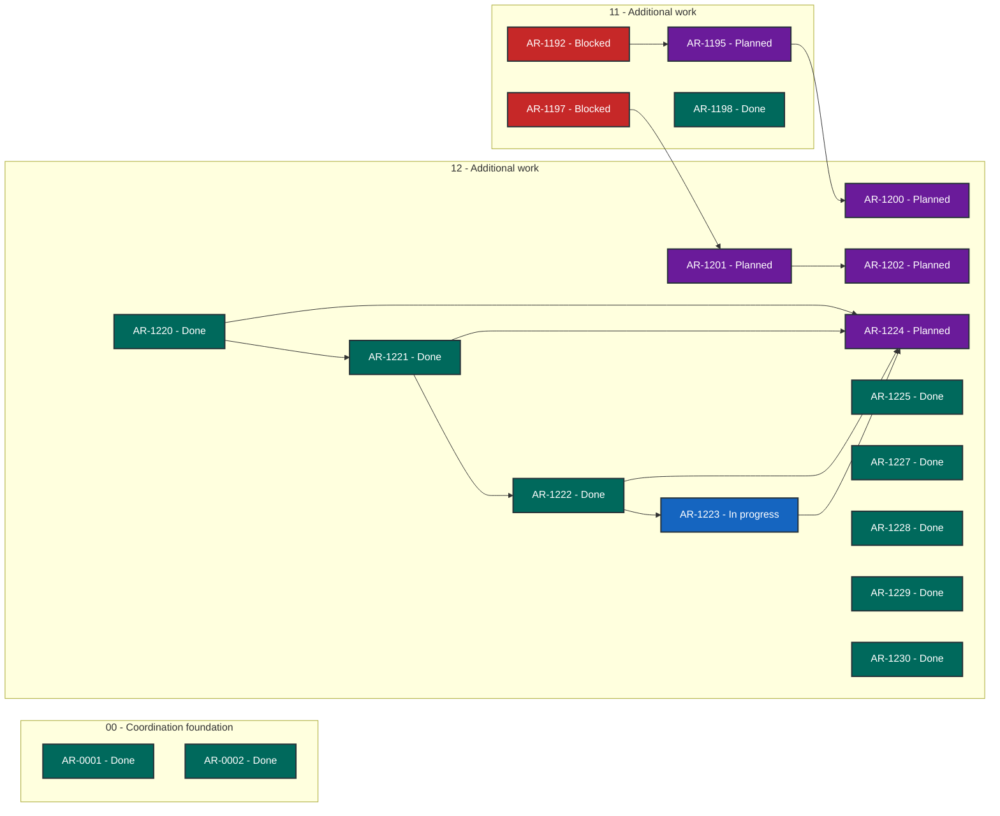

# ASB TUI status

> Generated deterministically from task front matter. Do not edit this file directly.
> Status records coordination progress; it is not evidence that product behavior is accepted.

## Portfolio overview

**19 ARs tracked** across 4 active status categories.

| Status | Meaning | Count |
| --- | --- | ---: |
| **In progress** | Claimed work with a live lease | 1 |
| **Open** | Dependency-ready and available to claim | 0 |
| **Blocked** | Cannot proceed until its recorded blocker clears | 2 |
| **Planned** | Defined work awaiting promotion or dependencies | 5 |
| **Future** | Deferred roadmap work | 0 |
| **Done** | Accepted, integrated, and durably verified | 11 |
| **Cancelled** | Stopped with a recorded rationale | 0 |
| **Superseded** | Replaced by another AR | 0 |

## Dependency graph

Arrows point from each prerequisite to the work that depends on it. Color is redundant
with the status text inside every node; the tables below are the complete text
alternative.

### Accessible dependency index

| AR | Prerequisites | Dependents |
| --- | --- | --- |
| [AR-0001](tasks/AR-0001.md) | None | None |
| [AR-0002](tasks/AR-0002.md) | None | None |
| [AR-1192](tasks/AR-1192-authenticated-agent-wizard.md) | None | [AR-1195](tasks/AR-1195-cross-repo-wire-compatibility.md) |
| [AR-1195](tasks/AR-1195-cross-repo-wire-compatibility.md) | [AR-1192](tasks/AR-1192-authenticated-agent-wizard.md) | [AR-1200](tasks/AR-1200-asb-router-client.md) |
| [AR-1197](tasks/AR-1197-startup-wizard-idempotence.md) | None | [AR-1201](tasks/AR-1201-formal-ui-source-parity.md) |
| [AR-1198](tasks/AR-1198-help-catalog-ci-hardening.md) | None | None |
| [AR-1200](tasks/AR-1200-asb-router-client.md) | [AR-1195](tasks/AR-1195-cross-repo-wire-compatibility.md) | None |
| [AR-1201](tasks/AR-1201-formal-ui-source-parity.md) | [AR-1197](tasks/AR-1197-startup-wizard-idempotence.md) | [AR-1202](tasks/AR-1202-live-resize-qualification.md) |
| [AR-1202](tasks/AR-1202-live-resize-qualification.md) | [AR-1201](tasks/AR-1201-formal-ui-source-parity.md) | None |
| [AR-1220](tasks/AR-1220-first-run-agent-tutorial.md) | None | [AR-1221](tasks/AR-1221-benchmark-readiness-tutorial.md), [AR-1224](tasks/AR-1224-tutorial-freshness-ci.md) |
| [AR-1221](tasks/AR-1221-benchmark-readiness-tutorial.md) | [AR-1220](tasks/AR-1220-first-run-agent-tutorial.md) | [AR-1222](tasks/AR-1222-tui-run-shared-config.md), [AR-1224](tasks/AR-1224-tutorial-freshness-ci.md) |
| [AR-1222](tasks/AR-1222-tui-run-shared-config.md) | [AR-1221](tasks/AR-1221-benchmark-readiness-tutorial.md) | [AR-1223](tasks/AR-1223-tui-replay-comparison.md), [AR-1224](tasks/AR-1224-tutorial-freshness-ci.md) |
| [AR-1223](tasks/AR-1223-tui-replay-comparison.md) | [AR-1222](tasks/AR-1222-tui-run-shared-config.md) | [AR-1224](tasks/AR-1224-tutorial-freshness-ci.md) |
| [AR-1224](tasks/AR-1224-tutorial-freshness-ci.md) | [AR-1220](tasks/AR-1220-first-run-agent-tutorial.md), [AR-1221](tasks/AR-1221-benchmark-readiness-tutorial.md), [AR-1222](tasks/AR-1222-tui-run-shared-config.md), [AR-1223](tasks/AR-1223-tui-replay-comparison.md) | None |
| [AR-1225](tasks/AR-1225-coverage-hardening-post-merge.md) | None | None |
| [AR-1227](tasks/AR-1227-formal-model-foundation-post-merge.md) | None | None |
| [AR-1228](tasks/AR-1228-formal-ownership-ci-post-merge.md) | None | None |
| [AR-1229](tasks/AR-1229-formal-transitions-post-merge.md) | None | None |
| [AR-1230](tasks/AR-1230-live-resize-post-merge.md) | None | None |

## Complete AR inventory

### In progress (1)

| Priority | AR | Owner | Summary | Next action |
| --- | --- | --- | --- | --- |
| P0 | [AR-1223](tasks/AR-1223-tui-replay-comparison.md): asb-tui record/replay and comparison tutorials | asb-tui-ar1223-replay-20260916 | Teach TUI users to replay LLM responses offline and compare multiple agents fairly. | Implement syntax-checked TUI tutorials for LLM record/replay and multi-agent result comparison. |

### Blocked (2)

| Priority | AR | Owner | Summary | Next action |
| --- | --- | --- | --- | --- |
| P0 | [AR-1192](tasks/AR-1192-authenticated-agent-wizard.md): Authenticated agent wizard integration | Unclaimed | Consume authenticated ASB agent catalog and lifecycle in the standalone wizard. | Wait for ASB to publish verified agent_catalog and lifecycle control methods; standalone codecs and projections are present on current asb-tui main, but backend capability negotiation still rejects these operations. |
| P0 | [AR-1197](tasks/AR-1197-startup-wizard-idempotence.md): Startup wizard readiness and idempotence | Unclaimed | Make authoritative startup readiness route into the wizard exactly once when ASB is unconfigured, with deterministic recovery and explanations. | ASB readiness contract AR-1227/AR-1199 is still unpublished; retain the verified local readiness seam and resume authoritative provider wiring when that contract is merged. |

### Planned (5)

| Priority | AR | Owner | Summary | Next action |
| --- | --- | --- | --- | --- |
| P0 | [AR-1195](tasks/AR-1195-cross-repo-wire-compatibility.md): Cross-repository wire compatibility | Unclaimed | Prove asb-tui consumes the exact authenticated ASB catalog and lifecycle wire contracts. | Complete independent exact-head review and cross-repository qualification against ASB catalog/lifecycle pins; do not promote while AR-1192 remains unfinished. |
| P0 | [AR-1200](tasks/AR-1200-asb-router-client.md): ASB router client adoption | Unclaimed | Adopt the authenticated ASB router from the standalone asb-tui lifecycle and UI. | Remain planned until ASB AR-1199 exposes a verified authenticated router; then implement client adoption and paired qualification. |
| P0 | [AR-1201](tasks/AR-1201-formal-ui-source-parity.md): Executable formal UI model and source parity | Unclaimed | Make every TUI source element and transition mechanically checkable against the formal UI model. | Promote after AR-1197 and inventory prerequisites are reviewed; implement the executable model/source parity manifest and CI gate in asb-tui. |
| P0 | [AR-1202](tasks/AR-1202-live-resize-qualification.md): Live terminal resize integration and qualification | Unclaimed | Handle terminal resize safely across every asb-tui route without losing state or violating the formal model. | Promote after AR-1201 defines the model binding; review PR #65 at its exact head and implement/qualify live resize in the standalone asb-tui application. |
| P0 | [AR-1224](tasks/AR-1224-tutorial-freshness-ci.md): Cross-repository tutorial syntax and freshness gate | Unclaimed | Keep asb-tui tutorial routes, actions, commands, and schemas syntactically current in CI. | Implement the cross-repository tutorial discovery and syntax-freshness CI gate after the TUI tutorial contracts are defined. |

### Done (11)

| Priority | AR | Owner | Summary | Next action |
| --- | --- | --- | --- | --- |
| P0 | [AR-0001](tasks/AR-0001.md): Adopt Agent Workflow Quality v0.32.0 | Unclaimed | Adopt AWQ v0.32.0 additively in shadow mode while retaining every native gate. | Coordinator must refresh PR #25 on current main, rerun exact-head required hosted checks, and decide whether to promote; retain additive shadow-only scope. |
| P0 | [AR-0002](tasks/AR-0002.md): Operationalize asb-tui agent coordination | Unclaimed | Operationalize the Git-backed coordinator without disrupting existing asb-tui work. | Rebase both draft candidates onto current main, rerun hosted required checks, and obtain coordinator promotion decision; no merge from review worker. |
| P0 | [AR-1220](tasks/AR-1220-first-run-agent-tutorial.md): asb-tui first-run and first-agent tutorial | Unclaimed | Teach first-time users to initialize asb-tui and configure their first agent connection. | Coordinator to monitor PR #107 exact head fb9d4b86270f4be11102868caff226fe35900e78, obtain independent review, and merge only after all required checks pass; then perform post-merge assurance. |
| P0 | [AR-1221](tasks/AR-1221-benchmark-readiness-tutorial.md): asb-tui benchmark-readiness tutorial | Unclaimed | Teach users to inspect TUI benchmark readiness without performing a run. | Implement the syntax-checked TUI tutorial for testing current agent benchmark readiness. |
| P0 | [AR-1222](tasks/AR-1222-tui-run-shared-config.md): asb-tui benchmark run and shared-agent configuration tutorials | Unclaimed | Teach TUI users to run a benchmark and apply one configuration to multiple agents. | Coordinator review PR #109 at exact head f607776; merge only after required checks and independent review pass. |
| P1 | [AR-1198](tasks/AR-1198-help-catalog-ci-hardening.md): Contextual-help catalog CI hardening | Unclaimed | Make document-backed contextual help complete, meaningful, privacy-safe, and continuously enforced by CI. | Complete final cross-check of help catalog, UI module inventory, formal model, and UI_OWNERS; retain startup readiness/persistence and authenticated catalog/lifecycle blockers. |
| P1 | [AR-1225](tasks/AR-1225-coverage-hardening-post-merge.md): Coverage hardening post-merge assurance | Unclaimed | Qualify asb-tui coverage hardening after merge. | Record the exact post-merge workflow run IDs and keep the task open if any required assurance is pending or fails. |
| P1 | [AR-1227](tasks/AR-1227-formal-model-foundation-post-merge.md): Formal UI model foundation post-merge assurance | Unclaimed | Qualify the corrected formal UI model foundation after merge. | Record exact post-merge workflow evidence for corrected PR #70. |
| P1 | [AR-1228](tasks/AR-1228-formal-ownership-ci-post-merge.md): Formal ownership CI post-merge assurance | Unclaimed | Qualify formal UI ownership CI after merge. | Record exact post-merge workflow conclusions for corrected PR #71. |
| P1 | [AR-1229](tasks/AR-1229-formal-transitions-post-merge.md): Executable formal transitions post-merge assurance | Unclaimed | Qualify executable formal UI transitions after merge. | None; retain as immutable post-merge assurance while AR-1201 tracks remaining parity work. |
| P1 | [AR-1230](tasks/AR-1230-live-resize-post-merge.md): Live resize post-merge assurance | Unclaimed | Qualify live resize state preservation after merge. | None; retain as immutable post-merge assurance while AR-1202 tracks formal resize transition and full route parity. |
