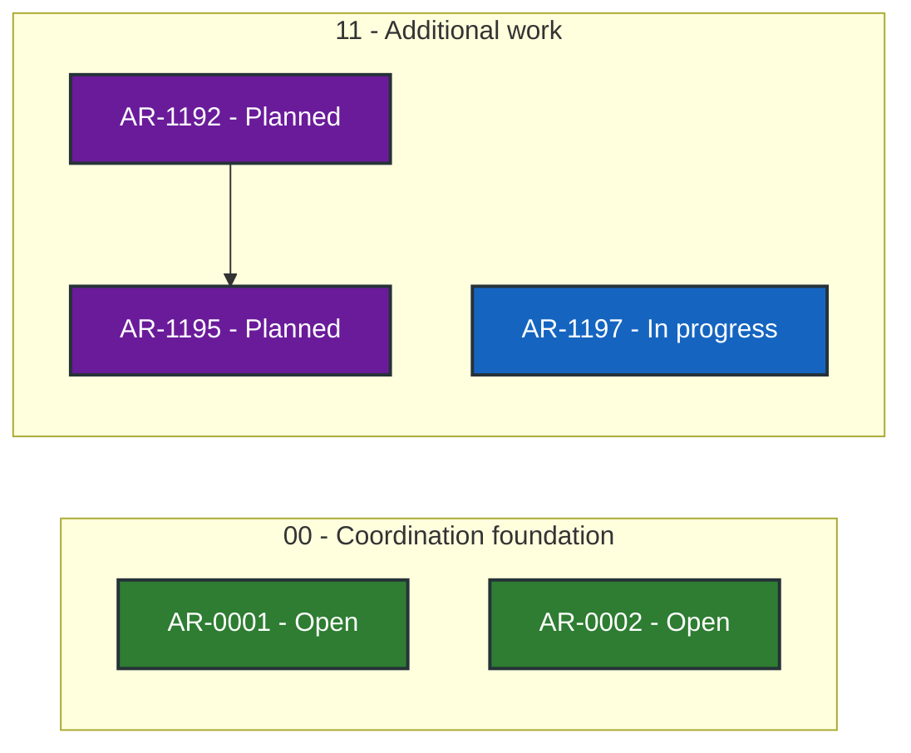

# ASB TUI status

> Generated deterministically from task front matter. Do not edit this file directly.
> Status records coordination progress; it is not evidence that product behavior is accepted.

## Portfolio overview

**5 ARs tracked** across 3 active status categories.

| Status | Meaning | Count |
| --- | --- | ---: |
| **In progress** | Claimed work with a live lease | 1 |
| **Open** | Dependency-ready and available to claim | 2 |
| **Blocked** | Cannot proceed until its recorded blocker clears | 0 |
| **Planned** | Defined work awaiting promotion or dependencies | 2 |
| **Future** | Deferred roadmap work | 0 |
| **Done** | Accepted, integrated, and durably verified | 0 |
| **Cancelled** | Stopped with a recorded rationale | 0 |
| **Superseded** | Replaced by another AR | 0 |

## Dependency graph

Arrows point from each prerequisite to the work that depends on it. Color is redundant
with the status text inside every node; the tables below are the complete text
alternative.

### Accessible dependency index

| AR | Prerequisites | Dependents |
| --- | --- | --- |
| [AR-0001](tasks/AR-0001.md) | None | None |
| [AR-0002](tasks/AR-0002.md) | None | None |
| [AR-1192](tasks/AR-1192-authenticated-agent-wizard.md) | None | [AR-1195](tasks/AR-1195-cross-repo-wire-compatibility.md) |
| [AR-1195](tasks/AR-1195-cross-repo-wire-compatibility.md) | [AR-1192](tasks/AR-1192-authenticated-agent-wizard.md) | None |
| [AR-1197](tasks/AR-1197-startup-wizard-idempotence.md) | None | None |

## Complete AR inventory

### In progress (1)

| Priority | AR | Owner | Summary | Next action |
| --- | --- | --- | --- | --- |
| P0 | [AR-1197](tasks/AR-1197-startup-wizard-idempotence.md): Startup wizard readiness and idempotence | root-ar1197-review | Make authoritative startup readiness route into the wizard exactly once when ASB is unconfigured, with deterministic recovery and explanations. | Review PR #87 at the exact head, then integrate it with AR-1187/#76 and the formal wizard model before promotion. |

### Open (2)

| Priority | AR | Owner | Summary | Next action |
| --- | --- | --- | --- | --- |
| P0 | [AR-0001](tasks/AR-0001.md): Adopt Agent Workflow Quality v0.32.0 | Unclaimed | Adopt AWQ v0.32.0 additively in shadow mode while retaining every native gate. | Coordinator may review draft PR 25 at exact head 2bc987ee0a9ad9b18807989501aca3fe87cab8be and, without worker-side merge, promote it only under repository policy. |
| P0 | [AR-0002](tasks/AR-0002.md): Operationalize asb-tui agent coordination | Unclaimed | Operationalize the Git-backed coordinator without disrupting existing asb-tui work. | Coordinator-only promotion decision for independently reviewed draft state PR #1 and product PR #24; workers must not merge. |

### Planned (2)

| Priority | AR | Owner | Summary | Next action |
| --- | --- | --- | --- | --- |
| P0 | [AR-1192](tasks/AR-1192-authenticated-agent-wizard.md): Authenticated agent wizard integration | Unclaimed | Consume authenticated ASB agent catalog and lifecycle in the standalone wizard. | Review external ASB AR-1190/1191/1186 dependencies, then promote and claim through handoffctl. |
| P0 | [AR-1195](tasks/AR-1195-cross-repo-wire-compatibility.md): Cross-repository wire compatibility | Unclaimed | Prove asb-tui consumes the exact authenticated ASB catalog and lifecycle wire contracts. | Align the standalone adapter with ASB v1.4/v1.5 canonical fixtures and run exact-head interoperability tests. |
