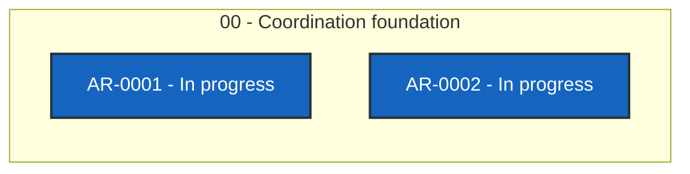

# ASB TUI status

> Generated deterministically from task front matter. Do not edit this file directly.
> Status records coordination progress; it is not evidence that product behavior is accepted.

## Portfolio overview

**2 ARs tracked** across 1 active status categories.

| Status | Meaning | Count |
| --- | --- | ---: |
| **In progress** | Claimed work with a live lease | 2 |
| **Open** | Dependency-ready and available to claim | 0 |
| **Blocked** | Cannot proceed until its recorded blocker clears | 0 |
| **Planned** | Defined work awaiting promotion or dependencies | 0 |
| **Future** | Deferred roadmap work | 0 |
| **Done** | Accepted, integrated, and durably verified | 0 |
| **Cancelled** | Stopped with a recorded rationale | 0 |
| **Superseded** | Replaced by another AR | 0 |

## Dependency graph

Arrows point from each prerequisite to the work that depends on it. Color is redundant
with the status text inside every node; the tables below are the complete text
alternative.

### Accessible dependency index

| AR | Prerequisites | Dependents |
| --- | --- | --- |
| [AR-0001](tasks/AR-0001.md) | None | None |
| [AR-0002](tasks/AR-0002.md) | None | None |

## Complete AR inventory

### In progress (2)

| Priority | AR | Owner | Summary | Next action |
| --- | --- | --- | --- | --- |
| P0 | [AR-0001](tasks/AR-0001.md): Adopt Agent Workflow Quality v0.32.0 | codex-asb-tui-awq-v032-20260913 | Adopt AWQ v0.32.0 additively in shadow mode while retaining every native gate. | Complete exact-head self-review and available native gates, create the signed DCO candidate, then request independent review before draft publication. |
| P0 | [AR-0002](tasks/AR-0002.md): Operationalize asb-tui agent coordination | codex-asb-tui-coordinator-ops-20260913 | Operationalize the Git-backed coordinator without disrupting existing asb-tui work. | Obtain independent exact-head review and confirm required CI for state PR #1 and product PR #24; do not merge. |
