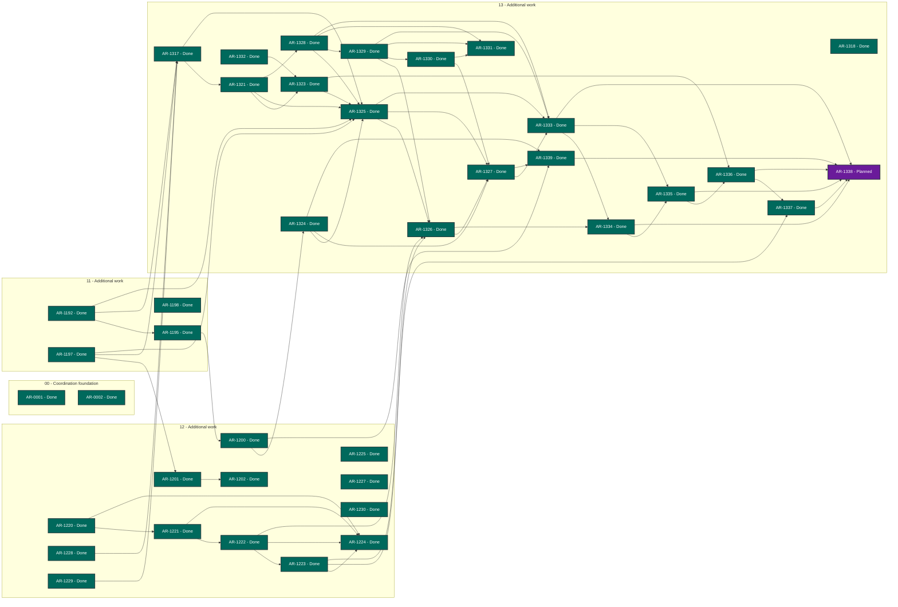

# ASB TUI status

> Generated deterministically from task front matter. Do not edit this file directly.
> Status records coordination progress; it is not evidence that product behavior is accepted.

## Portfolio overview

**39 ARs tracked** across 2 active status categories.

| Status | Meaning | Count |
| --- | --- | ---: |
| **In progress** | Claimed work with a live lease | 0 |
| **Open** | Dependency-ready and available to claim | 0 |
| **Blocked** | Cannot proceed until its recorded blocker clears | 0 |
| **Planned** | Defined work awaiting promotion or dependencies | 1 |
| **Future** | Deferred roadmap work | 0 |
| **Done** | Accepted, integrated, and durably verified | 38 |
| **Cancelled** | Stopped with a recorded rationale | 0 |
| **Superseded** | Replaced by another AR | 0 |

## Dependency graph

Arrows point from each prerequisite to the work that depends on it. Color is redundant
with the status text inside every node; the tables below are the complete text
alternative.

```mermaid
flowchart LR
    subgraph series_00["00 - Coordination foundation"]
        direction TB
        AR_0001["AR-0001 - Done"]:::status_done
        AR_0002["AR-0002 - Done"]:::status_done
    end
    subgraph series_11["11 - Additional work"]
        direction TB
        AR_1192["AR-1192 - Done"]:::status_done
        AR_1195["AR-1195 - Done"]:::status_done
        AR_1197["AR-1197 - Done"]:::status_done
        AR_1198["AR-1198 - Done"]:::status_done
    end
    subgraph series_12["12 - Additional work"]
        direction TB
        AR_1200["AR-1200 - Done"]:::status_done
        AR_1201["AR-1201 - Done"]:::status_done
        AR_1202["AR-1202 - Done"]:::status_done
        AR_1220["AR-1220 - Done"]:::status_done
        AR_1221["AR-1221 - Done"]:::status_done
        AR_1222["AR-1222 - Done"]:::status_done
        AR_1223["AR-1223 - Done"]:::status_done
        AR_1224["AR-1224 - Done"]:::status_done
        AR_1225["AR-1225 - Done"]:::status_done
        AR_1227["AR-1227 - Done"]:::status_done
        AR_1228["AR-1228 - Done"]:::status_done
        AR_1229["AR-1229 - Done"]:::status_done
        AR_1230["AR-1230 - Done"]:::status_done
    end
    subgraph series_13["13 - Additional work"]
        direction TB
        AR_1317["AR-1317 - Done"]:::status_done
        AR_1318["AR-1318 - Done"]:::status_done
        AR_1321["AR-1321 - Done"]:::status_done
        AR_1323["AR-1323 - Done"]:::status_done
        AR_1324["AR-1324 - Done"]:::status_done
        AR_1325["AR-1325 - Done"]:::status_done
        AR_1326["AR-1326 - Done"]:::status_done
        AR_1327["AR-1327 - Done"]:::status_done
        AR_1328["AR-1328 - Done"]:::status_done
        AR_1329["AR-1329 - Done"]:::status_done
        AR_1330["AR-1330 - Done"]:::status_done
        AR_1331["AR-1331 - Done"]:::status_done
        AR_1332["AR-1332 - Done"]:::status_done
        AR_1333["AR-1333 - Done"]:::status_done
        AR_1334["AR-1334 - Done"]:::status_done
        AR_1335["AR-1335 - Done"]:::status_done
        AR_1336["AR-1336 - Done"]:::status_done
        AR_1337["AR-1337 - Done"]:::status_done
        AR_1338["AR-1338 - Planned"]:::status_planned
        AR_1339["AR-1339 - Done"]:::status_done
    end
    AR_1192 --> AR_1195
    AR_1192 --> AR_1317
    AR_1192 --> AR_1325
    AR_1195 --> AR_1200
    AR_1197 --> AR_1201
    AR_1197 --> AR_1317
    AR_1197 --> AR_1325
    AR_1200 --> AR_1324
    AR_1200 --> AR_1339
    AR_1201 --> AR_1202
    AR_1220 --> AR_1221
    AR_1220 --> AR_1224
    AR_1221 --> AR_1222
    AR_1221 --> AR_1224
    AR_1222 --> AR_1223
    AR_1222 --> AR_1224
    AR_1222 --> AR_1326
    AR_1223 --> AR_1224
    AR_1223 --> AR_1326
    AR_1223 --> AR_1337
    AR_1228 --> AR_1317
    AR_1229 --> AR_1317
    AR_1317 --> AR_1321
    AR_1317 --> AR_1325
    AR_1321 --> AR_1323
    AR_1321 --> AR_1325
    AR_1321 --> AR_1328
    AR_1323 --> AR_1325
    AR_1323 --> AR_1336
    AR_1324 --> AR_1325
    AR_1324 --> AR_1327
    AR_1324 --> AR_1339
    AR_1325 --> AR_1326
    AR_1325 --> AR_1327
    AR_1325 --> AR_1333
    AR_1326 --> AR_1327
    AR_1326 --> AR_1334
    AR_1327 --> AR_1333
    AR_1327 --> AR_1339
    AR_1328 --> AR_1325
    AR_1328 --> AR_1329
    AR_1328 --> AR_1331
    AR_1328 --> AR_1333
    AR_1329 --> AR_1326
    AR_1329 --> AR_1330
    AR_1329 --> AR_1331
    AR_1329 --> AR_1333
    AR_1330 --> AR_1327
    AR_1330 --> AR_1331
    AR_1332 --> AR_1323
    AR_1333 --> AR_1334
    AR_1333 --> AR_1335
    AR_1333 --> AR_1338
    AR_1334 --> AR_1335
    AR_1334 --> AR_1338
    AR_1335 --> AR_1336
    AR_1335 --> AR_1338
    AR_1336 --> AR_1337
    AR_1336 --> AR_1338
    AR_1337 --> AR_1338
    AR_1339 --> AR_1338
    classDef status_in_progress fill:#1565c0,color:#ffffff,stroke:#263238,stroke-width:2px
    classDef status_open fill:#2e7d32,color:#ffffff,stroke:#263238,stroke-width:2px
    classDef status_blocked fill:#c62828,color:#ffffff,stroke:#263238,stroke-width:2px
    classDef status_planned fill:#6a1b9a,color:#ffffff,stroke:#263238,stroke-width:2px
    classDef status_future fill:#455a64,color:#ffffff,stroke:#263238,stroke-width:2px
    classDef status_done fill:#00695c,color:#ffffff,stroke:#263238,stroke-width:2px
    classDef status_cancelled fill:#616161,color:#ffffff,stroke:#263238,stroke-width:2px
    classDef status_superseded fill:#5d4037,color:#ffffff,stroke:#263238,stroke-width:2px
```

### Accessible dependency index

| AR | Prerequisites | Dependents |
| --- | --- | --- |
| [AR-0001](tasks/AR-0001.md) | None | None |
| [AR-0002](tasks/AR-0002.md) | None | None |
| [AR-1192](tasks/AR-1192-authenticated-agent-wizard.md) | None | [AR-1195](tasks/AR-1195-cross-repo-wire-compatibility.md), [AR-1317](tasks/AR-1317-secure-wizard-auth-handoff.md), [AR-1325](tasks/AR-1325-first-class-setup-wizard-route.md) |
| [AR-1195](tasks/AR-1195-cross-repo-wire-compatibility.md) | [AR-1192](tasks/AR-1192-authenticated-agent-wizard.md) | [AR-1200](tasks/AR-1200-asb-router-client.md) |
| [AR-1197](tasks/AR-1197-startup-wizard-idempotence.md) | None | [AR-1201](tasks/AR-1201-formal-ui-source-parity.md), [AR-1317](tasks/AR-1317-secure-wizard-auth-handoff.md), [AR-1325](tasks/AR-1325-first-class-setup-wizard-route.md) |
| [AR-1198](tasks/AR-1198-help-catalog-ci-hardening.md) | None | None |
| [AR-1200](tasks/AR-1200-asb-router-client.md) | [AR-1195](tasks/AR-1195-cross-repo-wire-compatibility.md) | [AR-1324](tasks/AR-1324-install-and-broker-onboarding.md), [AR-1339](tasks/AR-1339-top-level-install-launch.md) |
| [AR-1201](tasks/AR-1201-formal-ui-source-parity.md) | [AR-1197](tasks/AR-1197-startup-wizard-idempotence.md) | [AR-1202](tasks/AR-1202-live-resize-qualification.md) |
| [AR-1202](tasks/AR-1202-live-resize-qualification.md) | [AR-1201](tasks/AR-1201-formal-ui-source-parity.md) | None |
| [AR-1220](tasks/AR-1220-first-run-agent-tutorial.md) | None | [AR-1221](tasks/AR-1221-benchmark-readiness-tutorial.md), [AR-1224](tasks/AR-1224-tutorial-freshness-ci.md) |
| [AR-1221](tasks/AR-1221-benchmark-readiness-tutorial.md) | [AR-1220](tasks/AR-1220-first-run-agent-tutorial.md) | [AR-1222](tasks/AR-1222-tui-run-shared-config.md), [AR-1224](tasks/AR-1224-tutorial-freshness-ci.md) |
| [AR-1222](tasks/AR-1222-tui-run-shared-config.md) | [AR-1221](tasks/AR-1221-benchmark-readiness-tutorial.md) | [AR-1223](tasks/AR-1223-tui-replay-comparison.md), [AR-1224](tasks/AR-1224-tutorial-freshness-ci.md), [AR-1326](tasks/AR-1326-guided-benchmark-comparison-route.md) |
| [AR-1223](tasks/AR-1223-tui-replay-comparison.md) | [AR-1222](tasks/AR-1222-tui-run-shared-config.md) | [AR-1224](tasks/AR-1224-tutorial-freshness-ci.md), [AR-1326](tasks/AR-1326-guided-benchmark-comparison-route.md), [AR-1337](tasks/AR-1337-final-results-reports.md) |
| [AR-1224](tasks/AR-1224-tutorial-freshness-ci.md) | [AR-1220](tasks/AR-1220-first-run-agent-tutorial.md), [AR-1221](tasks/AR-1221-benchmark-readiness-tutorial.md), [AR-1222](tasks/AR-1222-tui-run-shared-config.md), [AR-1223](tasks/AR-1223-tui-replay-comparison.md) | None |
| [AR-1225](tasks/AR-1225-coverage-hardening-post-merge.md) | None | None |
| [AR-1227](tasks/AR-1227-formal-model-foundation-post-merge.md) | None | None |
| [AR-1228](tasks/AR-1228-formal-ownership-ci-post-merge.md) | None | [AR-1317](tasks/AR-1317-secure-wizard-auth-handoff.md) |
| [AR-1229](tasks/AR-1229-formal-transitions-post-merge.md) | None | [AR-1317](tasks/AR-1317-secure-wizard-auth-handoff.md) |
| [AR-1230](tasks/AR-1230-live-resize-post-merge.md) | None | None |
| [AR-1317](tasks/AR-1317-secure-wizard-auth-handoff.md) | [AR-1192](tasks/AR-1192-authenticated-agent-wizard.md), [AR-1197](tasks/AR-1197-startup-wizard-idempotence.md), [AR-1228](tasks/AR-1228-formal-ownership-ci-post-merge.md), [AR-1229](tasks/AR-1229-formal-transitions-post-merge.md) | [AR-1321](tasks/AR-1321-credential-helper-bridge.md), [AR-1325](tasks/AR-1325-first-class-setup-wizard-route.md) |
| [AR-1318](tasks/AR-1318-agent-catalog-protocol-compatibility.md) | None | None |
| [AR-1321](tasks/AR-1321-credential-helper-bridge.md) | [AR-1317](tasks/AR-1317-secure-wizard-auth-handoff.md) | [AR-1323](tasks/AR-1323-helper-execution-handoff.md), [AR-1325](tasks/AR-1325-first-class-setup-wizard-route.md), [AR-1328](tasks/AR-1328-development-credential-enrollment-route.md) |
| [AR-1323](tasks/AR-1323-helper-execution-handoff.md) | [AR-1321](tasks/AR-1321-credential-helper-bridge.md), [AR-1332](tasks/AR-1332-reconciled-development-runtime-fixture.md) | [AR-1325](tasks/AR-1325-first-class-setup-wizard-route.md), [AR-1336](tasks/AR-1336-launch-live-statistics.md) |
| [AR-1324](tasks/AR-1324-install-and-broker-onboarding.md) | [AR-1200](tasks/AR-1200-asb-router-client.md) | [AR-1325](tasks/AR-1325-first-class-setup-wizard-route.md), [AR-1327](tasks/AR-1327-cross-repository-journey-qualification.md), [AR-1339](tasks/AR-1339-top-level-install-launch.md) |
| [AR-1325](tasks/AR-1325-first-class-setup-wizard-route.md) | [AR-1192](tasks/AR-1192-authenticated-agent-wizard.md), [AR-1197](tasks/AR-1197-startup-wizard-idempotence.md), [AR-1317](tasks/AR-1317-secure-wizard-auth-handoff.md), [AR-1321](tasks/AR-1321-credential-helper-bridge.md), [AR-1323](tasks/AR-1323-helper-execution-handoff.md), [AR-1324](tasks/AR-1324-install-and-broker-onboarding.md), [AR-1328](tasks/AR-1328-development-credential-enrollment-route.md) | [AR-1326](tasks/AR-1326-guided-benchmark-comparison-route.md), [AR-1327](tasks/AR-1327-cross-repository-journey-qualification.md), [AR-1333](tasks/AR-1333-user-driven-provider-setup.md) |
| [AR-1326](tasks/AR-1326-guided-benchmark-comparison-route.md) | [AR-1222](tasks/AR-1222-tui-run-shared-config.md), [AR-1223](tasks/AR-1223-tui-replay-comparison.md), [AR-1325](tasks/AR-1325-first-class-setup-wizard-route.md), [AR-1329](tasks/AR-1329-development-provider-setup-integration.md) | [AR-1327](tasks/AR-1327-cross-repository-journey-qualification.md), [AR-1334](tasks/AR-1334-benchmark-pool-selection.md) |
| [AR-1327](tasks/AR-1327-cross-repository-journey-qualification.md) | [AR-1324](tasks/AR-1324-install-and-broker-onboarding.md), [AR-1325](tasks/AR-1325-first-class-setup-wizard-route.md), [AR-1326](tasks/AR-1326-guided-benchmark-comparison-route.md), [AR-1330](tasks/AR-1330-development-journey-qualification.md) | [AR-1333](tasks/AR-1333-user-driven-provider-setup.md), [AR-1339](tasks/AR-1339-top-level-install-launch.md) |
| [AR-1328](tasks/AR-1328-development-credential-enrollment-route.md) | [AR-1321](tasks/AR-1321-credential-helper-bridge.md) | [AR-1325](tasks/AR-1325-first-class-setup-wizard-route.md), [AR-1329](tasks/AR-1329-development-provider-setup-integration.md), [AR-1331](tasks/AR-1331-production-credential-hardening.md), [AR-1333](tasks/AR-1333-user-driven-provider-setup.md) |
| [AR-1329](tasks/AR-1329-development-provider-setup-integration.md) | [AR-1328](tasks/AR-1328-development-credential-enrollment-route.md) | [AR-1326](tasks/AR-1326-guided-benchmark-comparison-route.md), [AR-1330](tasks/AR-1330-development-journey-qualification.md), [AR-1331](tasks/AR-1331-production-credential-hardening.md), [AR-1333](tasks/AR-1333-user-driven-provider-setup.md) |
| [AR-1330](tasks/AR-1330-development-journey-qualification.md) | [AR-1329](tasks/AR-1329-development-provider-setup-integration.md) | [AR-1327](tasks/AR-1327-cross-repository-journey-qualification.md), [AR-1331](tasks/AR-1331-production-credential-hardening.md) |
| [AR-1331](tasks/AR-1331-production-credential-hardening.md) | [AR-1328](tasks/AR-1328-development-credential-enrollment-route.md), [AR-1329](tasks/AR-1329-development-provider-setup-integration.md), [AR-1330](tasks/AR-1330-development-journey-qualification.md) | None |
| [AR-1332](tasks/AR-1332-reconciled-development-runtime-fixture.md) | None | [AR-1323](tasks/AR-1323-helper-execution-handoff.md) |
| [AR-1333](tasks/AR-1333-user-driven-provider-setup.md) | [AR-1325](tasks/AR-1325-first-class-setup-wizard-route.md), [AR-1327](tasks/AR-1327-cross-repository-journey-qualification.md), [AR-1328](tasks/AR-1328-development-credential-enrollment-route.md), [AR-1329](tasks/AR-1329-development-provider-setup-integration.md) | [AR-1334](tasks/AR-1334-benchmark-pool-selection.md), [AR-1335](tasks/AR-1335-configuration-materialization.md), [AR-1338](tasks/AR-1338-end-to-end-benchmark-journey.md) |
| [AR-1334](tasks/AR-1334-benchmark-pool-selection.md) | [AR-1326](tasks/AR-1326-guided-benchmark-comparison-route.md), [AR-1333](tasks/AR-1333-user-driven-provider-setup.md) | [AR-1335](tasks/AR-1335-configuration-materialization.md), [AR-1338](tasks/AR-1338-end-to-end-benchmark-journey.md) |
| [AR-1335](tasks/AR-1335-configuration-materialization.md) | [AR-1333](tasks/AR-1333-user-driven-provider-setup.md), [AR-1334](tasks/AR-1334-benchmark-pool-selection.md) | [AR-1336](tasks/AR-1336-launch-live-statistics.md), [AR-1338](tasks/AR-1338-end-to-end-benchmark-journey.md) |
| [AR-1336](tasks/AR-1336-launch-live-statistics.md) | [AR-1323](tasks/AR-1323-helper-execution-handoff.md), [AR-1335](tasks/AR-1335-configuration-materialization.md) | [AR-1337](tasks/AR-1337-final-results-reports.md), [AR-1338](tasks/AR-1338-end-to-end-benchmark-journey.md) |
| [AR-1337](tasks/AR-1337-final-results-reports.md) | [AR-1223](tasks/AR-1223-tui-replay-comparison.md), [AR-1336](tasks/AR-1336-launch-live-statistics.md) | [AR-1338](tasks/AR-1338-end-to-end-benchmark-journey.md) |
| [AR-1338](tasks/AR-1338-end-to-end-benchmark-journey.md) | [AR-1333](tasks/AR-1333-user-driven-provider-setup.md), [AR-1334](tasks/AR-1334-benchmark-pool-selection.md), [AR-1335](tasks/AR-1335-configuration-materialization.md), [AR-1336](tasks/AR-1336-launch-live-statistics.md), [AR-1337](tasks/AR-1337-final-results-reports.md), [AR-1339](tasks/AR-1339-top-level-install-launch.md) | None |
| [AR-1339](tasks/AR-1339-top-level-install-launch.md) | [AR-1200](tasks/AR-1200-asb-router-client.md), [AR-1324](tasks/AR-1324-install-and-broker-onboarding.md), [AR-1327](tasks/AR-1327-cross-repository-journey-qualification.md) | [AR-1338](tasks/AR-1338-end-to-end-benchmark-journey.md) |

## Complete AR inventory

### Planned (1)

| Priority | AR | Owner | Summary | Next action |
| --- | --- | --- | --- | --- |
| P0 | [AR-1338](tasks/AR-1338-end-to-end-benchmark-journey.md): End-to-end first-class benchmark journey qualification | Unclaimed | Qualify the complete user-driven asb-tui setup, benchmark, live-statistics, results, and comparison journey. | Promote after all journey components and the top-level install/launch router are done; qualify the complete visible setup-to-results path with disposable development fixtures and exact evidence. |

### Done (38)

| Priority | AR | Owner | Summary | Next action |
| --- | --- | --- | --- | --- |
| P0 | [AR-0001](tasks/AR-0001.md): Adopt Agent Workflow Quality v0.32.0 | Unclaimed | Adopt AWQ v0.32.0 additively in shadow mode while retaining every native gate. | Coordinator must refresh PR #25 on current main, rerun exact-head required hosted checks, and decide whether to promote; retain additive shadow-only scope. |
| P0 | [AR-0002](tasks/AR-0002.md): Operationalize asb-tui agent coordination | Unclaimed | Operationalize the Git-backed coordinator without disrupting existing asb-tui work. | Rebase both draft candidates onto current main, rerun hosted required checks, and obtain coordinator promotion decision; no merge from review worker. |
| P0 | [AR-1192](tasks/AR-1192-authenticated-agent-wizard.md): Authenticated agent wizard integration | Unclaimed | Consume authenticated ASB agent catalog and lifecycle in the standalone wizard. | Development catalog and wizard integration is complete; live authenticated catalog publication remains future qualification, not a development prerequisite. |
| P0 | [AR-1195](tasks/AR-1195-cross-repo-wire-compatibility.md): Cross-repository wire compatibility | Unclaimed | Prove asb-tui consumes the exact authenticated ASB catalog and lifecycle wire contracts. | Complete independent exact-head review and cross-repository qualification against ASB catalog/lifecycle pins; do not promote while AR-1192 remains unfinished. |
| P0 | [AR-1197](tasks/AR-1197-startup-wizard-idempotence.md): Startup wizard readiness and idempotence | Unclaimed | Make authoritative startup readiness route into the wizard exactly once when ASB is unconfigured, with deterministic recovery and explanations. | Development startup routing and manual reconfiguration are complete; live readiness/catalog publication remains future qualification, not a development prerequisite. |
| P0 | [AR-1200](tasks/AR-1200-asb-router-client.md): ASB development router client adoption | Unclaimed | Adopt the ASB development router from the standalone asb-tui lifecycle and UI. | Promote and implement the development router client against the local contract fixtures; qualify install/status/upgrade/remove/launch with warning-only development fallback. |
| P0 | [AR-1201](tasks/AR-1201-formal-ui-source-parity.md): Executable formal UI model and source parity | Unclaimed | Make every TUI source element and transition mechanically checkable against the formal UI model. | Promote after AR-1197 and inventory prerequisites are reviewed; implement the executable model/source parity manifest and CI gate in asb-tui. |
| P0 | [AR-1202](tasks/AR-1202-live-resize-qualification.md): Live terminal resize integration and qualification | Unclaimed | Handle terminal resize safely across every asb-tui route without losing state or violating the formal model. | Promote after AR-1201 defines the model binding; review PR #65 at its exact head and implement/qualify live resize in the standalone asb-tui application. |
| P0 | [AR-1220](tasks/AR-1220-first-run-agent-tutorial.md): asb-tui first-run and first-agent tutorial | Unclaimed | Teach first-time users to initialize asb-tui and configure their first agent connection. | Coordinator to monitor PR #107 exact head fb9d4b86270f4be11102868caff226fe35900e78, obtain independent review, and merge only after all required checks pass; then perform post-merge assurance. |
| P0 | [AR-1221](tasks/AR-1221-benchmark-readiness-tutorial.md): asb-tui benchmark-readiness tutorial | Unclaimed | Teach users to inspect TUI benchmark readiness without performing a run. | Implement the syntax-checked TUI tutorial for testing current agent benchmark readiness. |
| P0 | [AR-1222](tasks/AR-1222-tui-run-shared-config.md): asb-tui benchmark run and shared-agent configuration tutorials | Unclaimed | Teach TUI users to run a benchmark and apply one configuration to multiple agents. | Coordinator review PR #109 at exact head f607776; merge only after required checks and independent review pass. |
| P0 | [AR-1223](tasks/AR-1223-tui-replay-comparison.md): asb-tui record/replay and comparison tutorials | Unclaimed | Teach TUI users to replay LLM responses offline and compare multiple agents fairly. | Implement syntax-checked TUI tutorials for LLM record/replay and multi-agent result comparison. |
| P0 | [AR-1224](tasks/AR-1224-tutorial-freshness-ci.md): Cross-repository tutorial syntax and freshness gate | Unclaimed | Keep asb-tui tutorial routes, actions, commands, and schemas syntactically current in CI. | Implement the cross-repository tutorial discovery and syntax-freshness CI gate after the TUI tutorial contracts are defined. |
| P0 | [AR-1317](tasks/AR-1317-secure-wizard-auth-handoff.md): Secure setup-wizard authentication handoff | Unclaimed | Complete secure API-key enrollment UX in the setup wizard without raw-key transport. | Continue with AR-1321: connect the documented secure handoff to an approved local credential helper and typed enrollment/status projection. |
| P0 | [AR-1318](tasks/AR-1318-agent-catalog-protocol-compatibility.md): Agent catalog protocol compatibility | Unclaimed | Keep asb-tui agent-catalog decoding compatible with the current ASB authenticated schema. | Update the TUI agent-catalog codec/projection for ASB&#x27;s signer, SBOM, license and target provenance fields, then publish exact fixture evidence. |
| P0 | [AR-1321](tasks/AR-1321-credential-helper-bridge.md): Credential-helper bridge for setup wizard | Unclaimed | Connect the setup wizard to an approved local credential helper without raw-key transport. | Continue with AR-1323 for negotiated runner-owned helper invocation; PR #134 merged the strict digest-only receipt codec and PR #136 now projects runner-authored auth status before configuration apply. |
| P0 | [AR-1323](tasks/AR-1323-helper-execution-handoff.md): Runner-owned credential-helper execution handoff | Unclaimed | Invoke the approved credential helper through the authenticated runner boundary. | Resolve the local runner reconciliation failure after a committed digest-only enrollment, then rerun v1.10 auth_helper_invoke and capture successful AuthStatus; production authorization remains unnecessary for development. |
| P0 | [AR-1324](tasks/AR-1324-install-and-broker-onboarding.md): Install and broker onboarding | Unclaimed | Make clean development ASB/asb-tui installation and local broker onboarding a selectable first step. | Promote after AR-1200; implement the clean development install, broker negotiation, and recovery route with explicit fixture/warning labels. |
| P0 | [AR-1325](tasks/AR-1325-first-class-setup-wizard-route.md): First-class setup wizard route | Unclaimed | Deliver a selection-driven first-run and reconfiguration wizard over the shared ASB setup contract. | Promote after the helper handoff and development onboarding dependencies are done; bind wizard screens to the local setup contract and add restart/cancellation evidence. |
| P0 | [AR-1326](tasks/AR-1326-guided-benchmark-comparison-route.md): Guided benchmark and comparison route | Unclaimed | Make benchmark, offline replay, and comparison a single guided TUI route. | Promote after AR-1222, AR-1223, and AR-1325; implement the selection-driven development campaign and comparison route. |
| P0 | [AR-1327](tasks/AR-1327-cross-repository-journey-qualification.md): Cross-repository first-class journey qualification | Unclaimed | Make the clean development install-to-comparison journey an asb-tui qualification gate. | PR #157 is at eae13ed; hosted Repository Quality, AWQ native gate, and AWQ core policy are green. Obtain independent exact-head review, merge, verify post-merge checks, then release. |
| P0 | [AR-1328](tasks/AR-1328-development-credential-enrollment-route.md): Development credential enrollment route | Unclaimed | Provide a development-only credential enrollment screen for the TUI wizard. | Promote after the helper/onboarding and ASB development-contract dependencies are complete; implement the selection-driven enrollment route with non-blocking local identity fallback. |
| P0 | [AR-1329](tasks/AR-1329-development-provider-setup-integration.md): Development provider setup integration | Unclaimed | Integrate development credential lifecycle with provider, model and default selection. | Promote after the setup and enrollment routes are ready; integrate provider/model/default changes, mock-provider validation, and warning-only auth/signature/key-management fallback. |
| P0 | [AR-1330](tasks/AR-1330-development-journey-qualification.md): Development credential journey qualification | Unclaimed | Qualify the development-only enrollment-to-offline-comparison journey. | Promote after the development setup and benchmark routes are complete; run the clean disposable mock journey with missing-auth/signature/key-management warning cases and publish exact evidence. |
| P0 | [AR-1332](tasks/AR-1332-reconciled-development-runtime-fixture.md): Reconciled development control-runtime fixture | Unclaimed | Provide a reconciled disposable control-runtime fixture for AR-1323. | Implement the asb-tui-compatible qualification harness and record successful v1.10 digest-only AuthStatus evidence; this repair unblocks AR-1323. |
| P0 | [AR-1333](tasks/AR-1333-user-driven-provider-setup.md): User-driven provider setup and configuration draft | Unclaimed | Let users configure supported providers, models, agents, defaults, and authentication references through the complete TUI wizard. | PR #159 exact head 51d9d74 is rebased onto current main and awaiting fresh hosted checks plus independent review; merge and release after both pass. |
| P0 | [AR-1334](tasks/AR-1334-benchmark-pool-selection.md): Benchmark pool and measure selection route | Unclaimed | Let users choose a benchmark pool and sub-select or deselect individual measures. | Promote after AR-1333; implement catalog-backed benchmark group, benchmark, and measure search and tri-state selection. |
| P0 | [AR-1335](tasks/AR-1335-configuration-materialization.md): ASB configuration materialization and preflight | Unclaimed | Generate and validate all supported ASB configuration files from reviewed TUI selections. | Await exact-head CI/review for d1b5129; merge AR-1335 when all hosted gates pass, then promote AR-1336. |
| P0 | [AR-1336](tasks/AR-1336-launch-live-statistics.md): Benchmark launch and live statistics route | Unclaimed | Run reviewed benchmark campaigns and show truthful live progress and statistics in the TUI. | Add complete successful V1.7+ poll_projection coverage fixture to raise Trusted main total line coverage from 89.43&#37; to &gt;=90&#37;; then open signed+DCO repair PR and verify exact-main checks. |
| P0 | [AR-1337](tasks/AR-1337-final-results-reports.md): Final performance results and report presentation | Unclaimed | Show final performance results, measure status, provenance, failures, and comparable recent runs. | Await successful exact-main Trusted verification for merge SHA d7e5a53b9f7df0a2540b283baf6a6c8ee7a3db68; Repository Quality is green, then release AR-1337 and promote AR-1338. |
| P0 | [AR-1339](tasks/AR-1339-top-level-install-launch.md): Top-level ASB TUI install and launch integration | Unclaimed | Make the supported top-level ASB commands install and launch the standalone asb-tui application safely. | PR #158 is green at exact head d47b27a; obtain independent review, merge, watch post-merge checks, then release. |
| P1 | [AR-1198](tasks/AR-1198-help-catalog-ci-hardening.md): Contextual-help catalog CI hardening | Unclaimed | Make document-backed contextual help complete, meaningful, privacy-safe, and continuously enforced by CI. | Complete final cross-check of help catalog, UI module inventory, formal model, and UI_OWNERS; retain startup readiness/persistence and authenticated catalog/lifecycle blockers. |
| P1 | [AR-1225](tasks/AR-1225-coverage-hardening-post-merge.md): Coverage hardening post-merge assurance | Unclaimed | Qualify asb-tui coverage hardening after merge. | Record the exact post-merge workflow run IDs and keep the task open if any required assurance is pending or fails. |
| P1 | [AR-1227](tasks/AR-1227-formal-model-foundation-post-merge.md): Formal UI model foundation post-merge assurance | Unclaimed | Qualify the corrected formal UI model foundation after merge. | Record exact post-merge workflow evidence for corrected PR #70. |
| P1 | [AR-1228](tasks/AR-1228-formal-ownership-ci-post-merge.md): Formal ownership CI post-merge assurance | Unclaimed | Qualify formal UI ownership CI after merge. | Record exact post-merge workflow conclusions for corrected PR #71. |
| P1 | [AR-1229](tasks/AR-1229-formal-transitions-post-merge.md): Executable formal transitions post-merge assurance | Unclaimed | Qualify executable formal UI transitions after merge. | None; retain as immutable post-merge assurance while AR-1201 tracks remaining parity work. |
| P1 | [AR-1230](tasks/AR-1230-live-resize-post-merge.md): Live resize post-merge assurance | Unclaimed | Qualify live resize state preservation after merge. | None; retain as immutable post-merge assurance while AR-1202 tracks formal resize transition and full route parity. |
| P2 | [AR-1331](tasks/AR-1331-production-credential-hardening.md): TUI production credential hardening follow-up | Unclaimed | Track future TUI credential secrecy and authentication hardening. | Keep non-gating until production deployment is requested; implement reviewed secure credential storage and authentication UX. |
